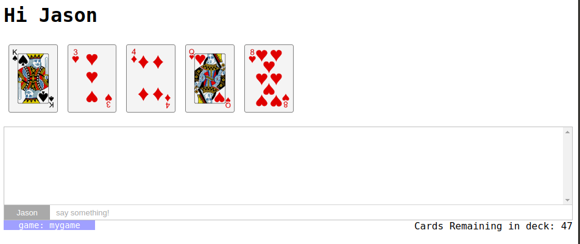

# card_game

This is a demo app for [lattice-core]() which is a framework for crystal that is still
very much in the proof-of-concept stage.  The intent is to really show how powerful
a WebSocket-first framework can be.  Kemal serves as an excellent base framework, and
crystal's ruby-like syntax with native speed brings everything together.

If you haven't spent some time investigation [crystal](crystal-lang.org), you're doing
yourself a disservice.  It is an _amazing_ language with an excellent library.

## Installation

clone this repo and run `shards install` 

## Usage

run the app with `crystal src/card_game.cr`
open a browser and go to `localhost:3000/cardgame/abc`
where `abc` becomes a new game at that address.  
Use chrome & firefox at the same url to show two different sessions accessing a game.

#Walk Through

First things first.  This demo _emulates_ a card game.  Imagine if you were playing poker
online against a few other people. Each of you is show a deck.  This is what that interface
might look like, but it's a facade intended more to show how the interaction between server
and client work.  It has a a deck of 52 cards which are drawn from randomly.  
But there's one hand, which all players see and interact with.  You can click until the deck
runs out.

That said, here's an opening page.

## Development

TODO: Write development instructions here

## Contributing

1. Fork it ( https://github.com/[your-github-name]/card_game/fork )
2. Create your feature branch (git checkout -b my-new-feature)
3. Commit your changes (git commit -am 'Add some feature')
4. Push to the branch (git push origin my-new-feature)
5. Create a new Pull Request

## Contributors

- [[your-github-name]](https://github.com/[your-github-name]) Jason Landry - creator, maintainer
