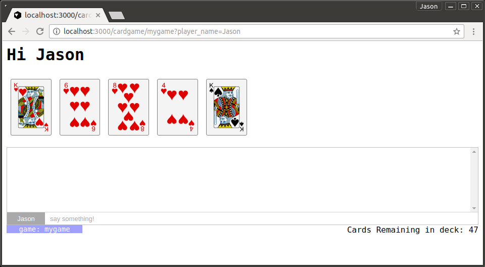
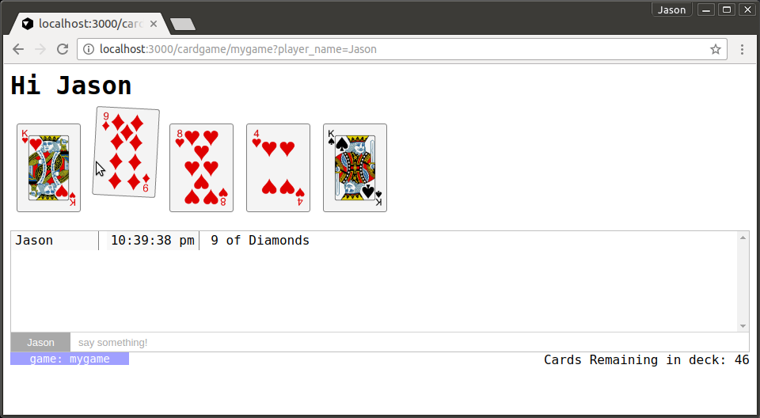
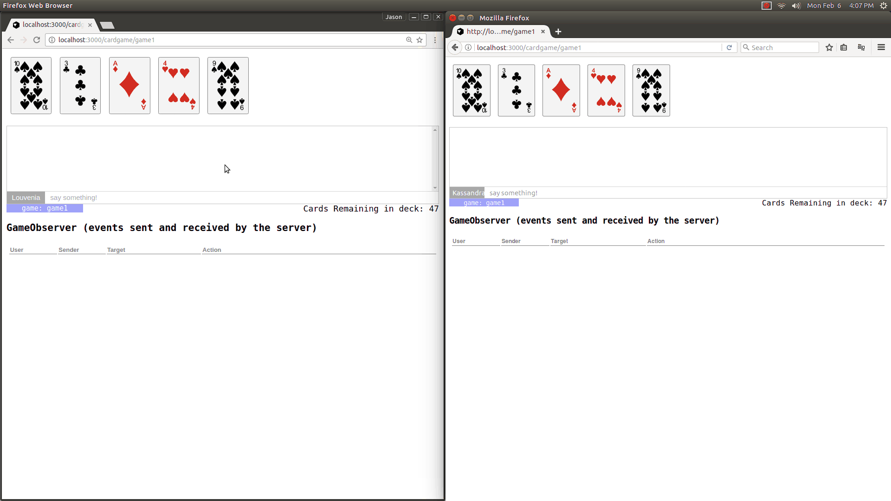

# card_game

This is a demo app for [lattice-core](https://github.com/jasonl99/lattice-core) which is a framework for crystal I'm working on that is still
very much in the proof-of-concept stage.  The intent is to really show how powerful a WebSocket-first framework can be.  Kemal serves as an excellent base, and crystal's ruby-like syntax with native speed brings everything together.

If you haven't spent some time investigation [crystal](http://crystal-lang.org), please take a look.  It is an _amazing_ language with an excellent library.

## Installation

```
git clone git@github.com:jasonl99/card_game.git
cd card_game
shards install
crystal src/card_game.cr
```

## Usage

Open a browser and go to `localhost:3000/cardgame/abc` where `abc` becomes a new game at that address.
Use Chrome, Firefox, Safari, or whatever browser you'd like at the same url to show more than one session accessing a game.  Imagine each browser is a different user in a different location.  Once a game is created, it stays in server memory (garbage collection is in progress on lattice-core.)

For demonstration purposes, each session is given a random username (so you'll have two different names if you have Chrome and Firefox both accessing the same game, which is cool, because it really shows how communication occurs between _all_ game users).  

The upper right corner also illustrates some of the power that lattice-core can provide.  It's a statistical summary of how many card games are running across the server, and how many of those games have no subscribers (ultimately the target for garbage collection).

#Walk Through

_These screenshots are bit outdated.  I will update them soon_

First things first.  This demo _emulates_ a card game.  Imagine if you were playing poker
online against a few other people. Each of you is shown a deck.   But there's one hand, which all players see and interact with.  If the deck runs out, a new deck is shuffled.

That said, here's an opening page.



This is pretty straightforward.  In fact, here's the for the game, the hand, and the first
card, including some data- attributes that will be discussed in detail later...

```html
<h1>Hi Jason</h1>
<div data-item="cardgame-94243174726304">
  <div id="hand">
    <span class="card-holder">
      
    </span>
    ... more card holder spans
  </div>
</div>
```

Nothing fancy.  There's under 100 lines of javascript code, and no external libraries like
jQuery, lodash, underscore, etc (not that you wouldn't ulimately use those; it's just that 
they are not needed for this framework).

There in an in-game chat that allows player communcation, and it also shows when a player
draws a card.  Simple stuff.

So we have the stage set:  We have a "game" that can have many players, each of who interact with
a set of playing cards.   Suppose I want to change the second card, which I do by clicking the
card itself:


In the above example, I'm hovering over the six of hearts.  Now I click:



With one click, the image has changed, the number of cards remaining has decreased from 47 to 46,
and a new chat message has been entered that shows I picked the 9 of Diamonds.

Ok, sure, that's interesting.  There could be some ugly javascript doing some smoke-and-mirrors
that make things _look_ interesting.  But how is this different?

Let's try something a little more impressive, and add an animated gif while we're at it.

We're going to have Chrome on the left, Firefox on the right, both going to the same game named
`game1`. 

In this example, a GameObserver object has been added to the game.  This observer receives events directly from WebObjects that it's listening to.  In the case, we do nothing more than display those events.

Notice that each click on a card updates the card for both players, across different browsers, 
and it does it about as close to real time as you can get.  Notice, too, that the chat window
updates with the card drawn by each user, and the Cards Remaining In Deck update as well.  In this example, I've also created a tracking event on typing in the chat form:  every time I type, and event goes to the server and out to _each_ client.  Distributed events!




## Contributors
- [Jason Landry](https://github.com/jasonl99) creator, maintainer
